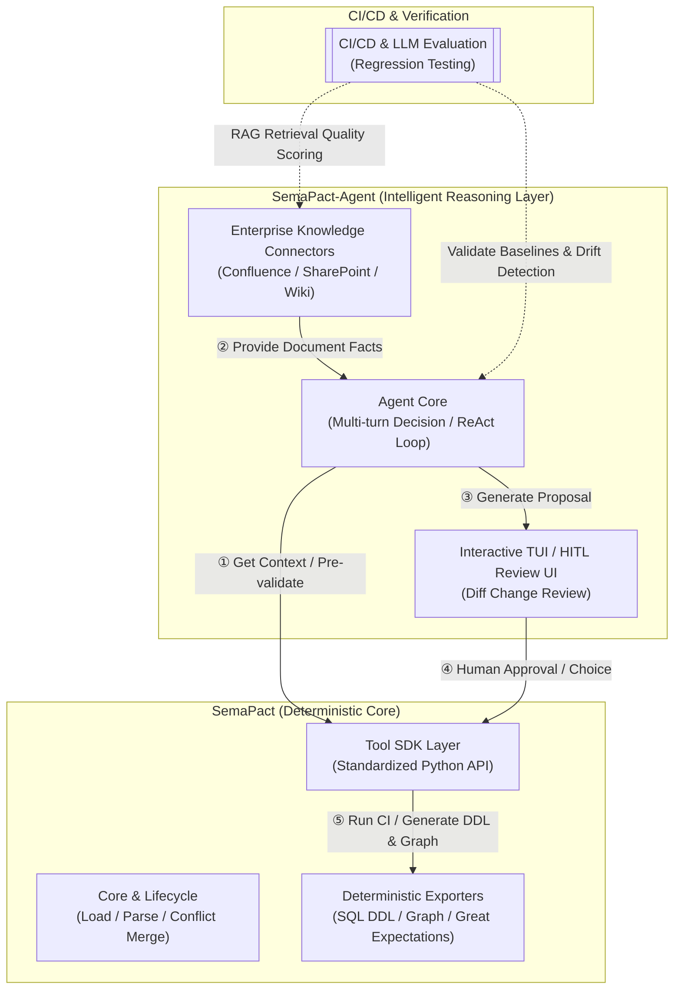
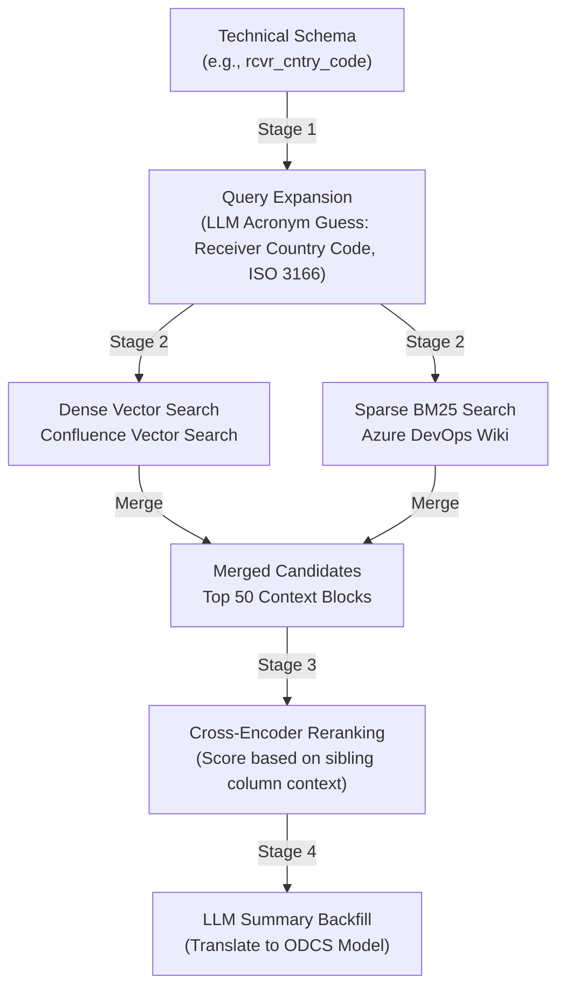
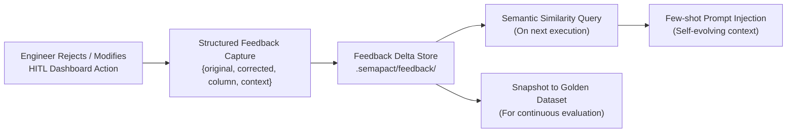
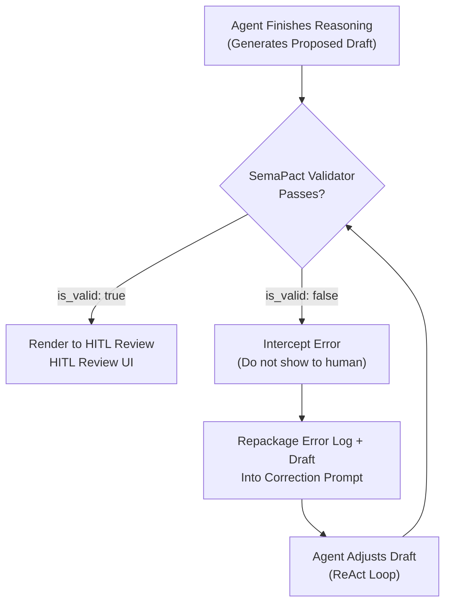

# SemaPact Architecture Roadmap

> This project aims to evolve data contracts from traditional "static YAML definitions" to **an intelligent contract governance system driven by LLMs, complete with closed-loop autonomous verification and human-in-the-loop (HITL) review capabilities**.

---

## Table of Contents

1. [System Topology Overview](#1-system-topology-overview)
2. [Core Division and Boundaries](#2-core-division-and-boundaries)
3. [Agent Runtime Environments & Deployment](#3-agent-runtime-environments--deployment)
4. [Agent Trigger Mechanisms](#4-agent-trigger-mechanisms)
5. [RAG: Bridging the Semantic Gap](#5-rag-bridging-the-semantic-gap)
6. [360° Impact Radius Analysis](#6-360-impact-radius-analysis)
7. [Closed-Loop Feedback Loop Store](#7-closed-loop-feedback-loop-store)
8. [Shift-Left Validation & Self-Correction](#8-shift-left-validation--self-correction)
9. [Continuous LLM Evaluation Pipeline](#9-continuous-llm-evaluation-pipeline)
10. [Key Value & Advantages](#10-key-value--advantages)

---

## 1. System Topology Overview

The system is split into two distinct projects: the **Engine Layer (SemaPact)** and the **Agent Layer (SemaPact-Agent)**, decoupled and collaborating via a standardized Tool SDK.



---

## 2. Core Division and Boundaries

### 📌 SemaPact — Deterministic Governance Engine

**Core Position**: Handles all deterministic inputs and outputs, serving as the standard runtime and compiler for data contracts. It is entirely agnostic of specific Agent frameworks (like LangGraph).

| Responsibility | Description |
|------|------|
| Contract Validation & Merge | Check ODCS syntax, compare Draft vs Main versions, detect conflicts and breaking changes |
| Deterministic Export | Generate deterministic SQL DDL, Graph topology, and Great Expectations suites from contract YAMLs |
| Single LLM I/O Service | Provide base Prompt templates and single-turn LLM JSON extraction (`llm_client.py`, plug-and-play) |
| Tool SDK | Expose structured API endpoints to be consumed as Tools by upper-layer Agents |

### 🤖 SemaPact-Agent — AI Business Orchestration & Reasoning

**Core Position**: Handles non-deterministic fuzzy reasoning and business alignment. It translates complex business realities into standard draft contracts via multi-turn reasoning and external retrieval.

| Responsibility | Description |
|------|------|
| RAG Alignment | Connect to Confluence, SharePoint, and Wiki to map technical column names to real-world business glossary |
| Self-Verification Loop | Sample-run SQL queries to verify if inferred foreign key joins hold true; dry-run DQ rules to measure pass rates |
| Proposal Generation | Convert enrichments and schema diffs into a structured Change List for human review |
| Human-in-the-Loop UI | Provide an interactive review dashboard where engineers can `approve` or `reject` AI proposals |

---

## 3. Agent Runtime Environments & Deployment

Depending on enterprise infrastructure, SemaPact-Agent supports three primary deployment configurations:

### ☁️ Databricks Workflows / Jobs

- **Advantages**: Native access permissions to Unity Catalog metadata and Delta physical tables
- **Mechanism**: Runs as a Python Wheel Task or Databricks Notebook. It extracts profiles via Spark. Confluence/SharePoint knowledge docs are synced to Delta tables and indexed using **Databricks Vector Search**, allowing the Agent to fetch semantic context via vector search endpoints in milliseconds

### 🐳 Docker / Kubernetes (K8s) Pods

- **Advantages**: Cloud-native microservices architecture, highly scalable
- **Mechanism**: Runs as a background service or CronJob. Authenticates and accesses cloud credentials/storage via Pod Managed Identities

### 🔷 Azure AI Foundry / Azure ML Pipelines

- **Advantages**: Seamless integration with the Microsoft enterprise ecosystem
- **Mechanism**: Indexes wiki docs using Azure AI Search, uses Azure OpenAI Service for text generation, and supports enterprise-grade OAuth / Microsoft Graph security out of the box

---

## 4. Agent Trigger Mechanisms

The Agent supports four trigger modes to align with different engineering workflows:

| Trigger Mode | Conditions | Typical Behavior |
|------|---------|---------|
| **Event-Driven Webhook** | Data source schema changes, or a Git PR with contract modifications | Automatically runs schema diff analysis and comments the Proposal Diff back to the PR / Draft Review |
| **Interactive Chat / Bot** | Triggered by engineer mentions (e.g., in Slack or Microsoft Teams) | Executes interactively, returning proposal links or Textual TUI launcher links |
| **Scheduled CLI Batch Sync** | Triggered periodically by scheduler (e.g., Airflow Cron) | Scans for newly added columns in physical tables, fetches wiki context, and fills empty metadata fields |
| **Offline Evaluation Mode** | Triggered automatically by CI/CD workflows | Evaluates LLM outputs against a Golden Dataset to assert accuracy and quality metrics without committing changes |

---

## 5. RAG: Bridging the Semantic Gap

Standard vector chunk search **cannot fully resolve the semantic gap between technical abbreviations and business terminology** (e.g., searching for `rcvr_cntry_code` may fail to recall a wiki page explaining "Receiver Country Code").

To bridge this, we implement a **four-stage index and mapping strategy**:



**Workflow Details:**

1. **Query Expansion & Acronym Translation**: Before querying the knowledge base, the internal LLM expands technical abbreviations into likely business synonyms (e.g., `rcvr` → `Receiver`, `cntry` → `Country`)
2. **Hybrid Search**: Combines **dense vector search** (for conceptual semantic matching) with **sparse BM25 search** (for exact acronym matching) across Confluence and Git Wikis
3. **Cross-Encoder Reranking**: Inputs top-50 results into a lightweight Cross-Encoder, using the metadata of neighboring columns as context clues to filter false positives
4. **Knowledge Graph / Synonym Dictionary**: Falls back to a local acronym glossary (e.g., `rcvr` → `receiver`) for deterministic resolution

---

## 6. 360° Impact Radius Analysis

Contract governance does not happen in isolation. Altering a schema property ripples through both **physical table joins** and **downstream ETL pipelines**.

SemaPact automates lineage extraction from Databricks Unity Catalog (see [unity_lineage.py](file:///Volumes/mainstorage/dev/datacontract-flow/semapact/importers/unity_lineage.py), which reads system lineage catalogs to populate ODCS `transformSourceObjects` and `transformLogic`).

Using this lineage graph, the Agent performs a "dual-track" impact radius analysis when properties are updated or deleted:

### Track 1: Static Join Breakdown

- **Mechanism**: Calls `GraphExporter` to generate the relationship topology
- **Analysis**: Detects if altering a join key (e.g., `orders.cust_ref`) breaks static foreign key paths to target tables (e.g., `customers.id`)

### Track 2: Dynamic Lineage Disruption

- **Mechanism**: Scans `transformSourceObjects` column-level lineage attributes in the contract
- **Analysis**: Traces downstream dependencies from the modified source column (e.g., basic field `grid_metrics.voltage_raw`) to downstream calculated values (e.g., average metric `voltage_daily_avg`), warning of pipeline breakage

### Automatic Dual-Track Warnings

Whenever the Agent proposes a change, it prepends a warning to the proposal:

> [!WARNING]
> **360° Impact Radius Warning (Impact: 1 Broken Join, 2 Broken Lineage Columns)**
>
> This change will impact downstream systems:
> - **Broken Join**: The link between `cust_ref` in [orders.yaml](file:///contracts/orders.yaml) and `id` in [customers.yaml](file:///contracts/customers.yaml) will be severed.
> - **Broken Lineage**: Downstream metric `voltage_daily_avg` in [grid_hourly_summary.yaml](file:///contracts/grid_hourly_summary.yaml) depends on this field; the downstream Spark/SQL job may fail unless its `transformLogic` is updated.

---

## 7. Closed-Loop Feedback Loop Store

Human feedback should not just block invalid configurations; it should continuously evolve the system's reasoning accuracy.



**Operational Steps:**

1. **Correction Capture**: When an engineer rejects an AI suggestion or edits an auto-generated DQ rule, the HITL interface captures a structured event.
2. **Delta Store Logging**: The correction is appended to a local `.semapact/feedback/` directory or a Delta metadata table.
3. **Few-Shot Prompt Injection**: When processing similar column structures in the future, the Agent queries the feedback database and injects historic human corrections as Few-Shot examples.
4. **Dataset Snapshotting**: Feedback data is regularly compiled into the Golden Dataset used by the regression evaluation pipeline.

> [!TIP]
> This data fly-wheel allows the Agent to become **increasingly accurate** within specialized domains (such as energy distribution or algorithmic trading) without rebuilding models.

---

## 8. Shift-Left Validation & Self-Correction

To prevent the Agent from proposing drafts that have syntax errors, break ODCS constraints, or miss primary keys, we implement an **implicit closed-loop Self-Correction Loop**.



**Self-Correction Process:**

- **Implicit Validation**: Immediately after writing a draft, and **before submitting it to the engineer**, the Agent runs it through the local `validator.py` engine.
- **Self-Correction ReAct Loop**: If the validator throws errors (e.g., `"missing required root property: version"` or `"primaryKey column email does not exist"`), the Agent captures the logs, formats a correction prompt, and repairs the draft. The loop repeats until the schema passes validation.

---

## 9. Continuous LLM Evaluation Pipeline

Because LLMs suffer from "Prompt Drift" and API updates are unpredictable, we deploy an automated regression pipeline to ensure that RAG retrieval quality and schema generation accuracy do not degrade over time.

### 9.1 Evaluation Objectives

This pipeline replaces traditional software unit tests with semantic evaluation metrics for non-deterministic code. It blocks any code or prompt changes that lead to hallucinations, formatting errors, or RAG drop-offs. It measures three core dimensions:

### 9.2 Golden Dataset Curation

The test suite directly consumes human corrections collected in the Feedback Delta Store (Section 7). Approved contract configurations are converted into test inputs:

```
(Input Schema Diff,  Retrieved Document Context,  Expected Golden Contract YAML)
```

### 9.3 Hybrid Evaluation Metrics

| Metric Dimension | Mechanism | Success Criteria |
|---------|---------|---------|
| **Deterministic Score** | SemaPact Core Validation Engine | 100% compliance with ODCS syntax and rules (Hard Gate) |
| **RAG Retrieval Score** | Evaluates retrieval relevance during Stage-2 | Context Precision and Recall must meet or exceed baseline thresholds |
| **LLM-as-a-Judge Score** | GPT-4o / Claude Sonnet as a judge comparing output to Golden standard | Semantic similarity >= 95%, with zero critical constraints missed |

### 9.4 CI/CD Gate Integration

- **Execution**: When prompt templates are edited, RAG logic is refactored, or the default LLM version is upgraded, the CI/CD pipeline (GitHub Actions, GitLab CI, or Azure Pipelines) triggers the evaluation job.
- **Gate Gating**: Code merges are blocked unless the new configuration maintains or improves on baseline scores **and** achieves a 100% Deterministic validation pass rate.

---

## 10. Key Value & Advantages

| Value | Detail |
|------|------|
| **Decoupled Architecture** | The core validator and lifecycle engine do not import heavy Agent SDKs (like LangGraph), ensuring minimal builds and lightweight CI runners |
| **Dual-Mode Workflow** | Data research engines (like Suoji-SQL) can use the CLI compiler directly, while corporate engineering pipelines utilize the Agent layer to integrate with internal glossaries |
| **Continuous Self-Evolution** | Captured HITL corrections fuel few-shot examples and golden test datasets, creating a continuous improvement cycle |
| **360° Safety Net** | Shift-left validation loops and dual-track impact checks guarantee that LLM-generated changes are verified before they reach human reviewers |

