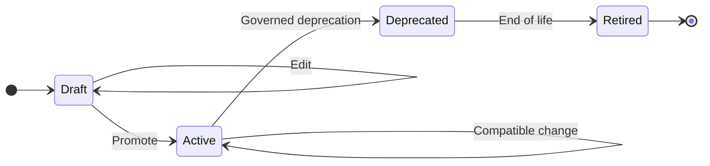

# SemaPact

**Lifecycle governance for data contracts and enterprise semantics.**

SemaPact is an open-source, change-driven governance layer for evolving data products safely.

It turns data contracts from static YAML specifications into governed lifecycle artifacts — with deterministic change analysis, breaking-change detection, deprecation, version policy, GitOps workflows, and runtime metadata integration.

SemaPact uses the **Open Data Contract Standard (ODCS)** as its canonical contract representation and is designed to integrate deeply with modern data platforms such as **Databricks Unity Catalog**, while keeping its governance core platform-independent.

> **SemaPact is not another metadata catalog or CRUD editor. It governs how data products are allowed to change.**

---

## Why SemaPact?

Validating a data contract is the easy part.

The harder problem starts when the data product changes.

What happens when:

* a column disappears?
* a required field becomes optional?
* a decimal loses precision?
* a physical type changes?
* an active field needs to be deprecated?
* business semantics change?
* production metadata drifts from the approved contract?
* multiple tools produce assets into the same data platform?
* an AI agent needs to know which semantics are actually approved?

SemaPact treats these as **governance decisions**, not YAML editing operations.

```text
Current Contract
       +
Proposed Change
       +
Runtime Evidence
       ↓
┌──────────────────────────────┐
│           SemaPact           │
│                              │
│  Normalize → Analyze →       │
│  Policy → Governed Decision  │
└──────────────────────────────┘
       ↓
Allow / Block / Deprecate / Review
       ↓
GitOps release + deployment
```

---

## Core Principles

### Change-driven, not CRUD

Governance begins with the difference between an approved state and a proposed state.

SemaPact is designed around **change analysis**, rather than directly editing the canonical contract in place.

### Deterministic by default

The same base contract, candidate contract, and governance context should produce the same result.

Lifecycle policy belongs in deterministic code, not in UI state or LLM reasoning.

### Contracts as code

Approved contracts live in Git and evolve through reviewable, CI/CD-friendly workflows.

### Runtime-aware

Git represents declared state.

Platforms such as Unity Catalog represent observed runtime state.

SemaPact is designed to reconcile the two rather than assuming they are always identical.

### Business semantics without schema ownership

Business users should be able to contribute descriptions and semantic context without silently changing technical schemas.

Physical schema evolution remains an engineering responsibility.

### Agent-ready governance

AI systems can consume approved contracts and semantic context, but agents do not become the authority that decides governance policy.

---

## What SemaPact Governs

| Area               | SemaPact responsibility                                 |
| ------------------ | ------------------------------------------------------- |
| Schema evolution   | Detect and classify structural changes                  |
| Breaking changes   | Identify incompatible changes before release            |
| Lifecycle          | Govern Draft → Active → Deprecated → Retired            |
| Version policy     | Determine lifecycle and release implications            |
| Business semantics | Preserve governed human-authored metadata               |
| Quality contracts  | Govern quality intent independently of runtime engines  |
| Runtime drift      | Compare approved contracts with observed platform state |
| GitOps             | Produce deterministic, reviewable contract changes      |
| Relationships      | Preserve relationship metadata for impact analysis      |
| AI context         | Provide approved semantics for downstream agents        |

SemaPact does **not** aim to replace transformation engines, data catalogs, orchestration systems, or data quality runtimes.

---

## SemaPact + Databricks Unity Catalog

Unity Catalog and SemaPact solve different parts of the governance problem.

> **Unity Catalog tells you what exists.
> SemaPact governs how it is allowed to change.**

```text
              Git / ODCS
          approved desired state
                  │
                  ▼
            ┌──────────┐
            │ SemaPact │
            └──────────┘
             ▲        │
             │        │ governance decision
runtime      │        ▼
evidence     │     CI / GitOps
             │        │
             │        ▼
       Unity Catalog / Databricks
          observed runtime state
```

Unity Catalog remains responsible for runtime assets, access control, lineage, metadata, and platform enforcement.

SemaPact adds lifecycle-aware governance around those assets:

* breaking-change analysis before deployment
* lifecycle and version policy
* governed semantic evolution
* Git-based review
* runtime drift detection
* governance decision history
* approved context for downstream systems and AI agents

SemaPact is designed to become **Unity Catalog-native without making its governance kernel Unity Catalog-dependent**.

---

## Works With Your Data Stack

A governed data product may be created by many different tools.

```text
dbt ───────────────────┐
Lakeflow Pipelines ────┤
Spark / PySpark ───────┤
Databricks SQL ────────┤
SQL DDL ───────────────┤
External pipelines ────┘
                       ↓
                 Runtime assets
                       ↓
                   SemaPact
                       ↓
             Governed evolution
```

SemaPact is therefore not tied to dbt or any single transformation framework.

**dbt** can build analytical data products.

**Lakeflow Pipelines** can build batch and streaming data pipelines.

**Unity Catalog** can govern runtime assets and permissions.

**Great Expectations** can execute data quality checks.

**SemaPact governs the lifecycle of the contract that connects them.**

---

## Why Not Just dbt Contracts?

dbt model contracts are useful for enforcing model interfaces inside dbt projects.

SemaPact addresses a broader problem:

* not every enterprise data asset is built with dbt
* production assets may be created by Spark, Lakeflow, SQL, notebooks, or external systems
* lifecycle governance should not depend on one transformation framework
* runtime state can drift independently of declared dbt state
* business semantic governance may involve users who never interact with a dbt project

SemaPact can integrate with dbt, but dbt is one producer of governed data assets rather than the center of the architecture.

---

## Why Not Just a Data Contract CLI?

Schema validation and format conversion are important, but they are only part of the problem.

SemaPact focuses on what happens **between contract versions**:

```text
Version N
   ↓
Proposed change
   ↓
Breaking analysis
   ↓
Lifecycle policy
   ↓
Governance decision
   ↓
Version N+1
```

The goal is not simply to determine whether a YAML document is valid.

The goal is to determine whether a proposed change is **safe, compatible, reviewable, and allowed**.

---

## Quick Start


### 1. Set up the development environment

```bash
uv sync --group dev
```

### 2. Import a contract from SQL

```bash
uv run semapact import \
  --format sql-folder \
  --source ./my_sales_ddl \
  --output ./contracts/sales.yaml
```

SemaPact uses ODCS as the canonical representation of the resulting contract.

### 3. Introduce a breaking change

For example, change:

```text
DECIMAL(10,2)
```

to:

```text
DECIMAL(8,2)
```

Then run the lifecycle merge:

```bash
uv run semapact merge \
  --base ./generated.yaml \
  --business ./contracts/sales.yaml \
  --output ./contracts/sales.merged.yaml
```

The lifecycle engine detects the precision reduction as an incompatible change instead of silently replacing the approved field definition.

---

## Lifecycle Governance

SemaPact currently models the following lifecycle:



Lifecycle state affects how changes are evaluated.

For example, an active field should not simply disappear from a new source snapshot. SemaPact can preserve the field as deprecated so that contract history and downstream expectations remain explicit.

Current breaking-change checks include scenarios such as:

* logical type incompatibility
* physical type changes
* decimal precision reduction
* decimal scale reduction
* required/nullability tightening
* removal of active fields

---

## Current Capabilities

### Contract Ingestion

SemaPact can build ODCS contracts from sources including:

* SQL folders
* Delta DDL
* Delta tables
* Databricks Unity Catalog

Importers are responsible for describing external state.

They should not contain lifecycle policy or CI/CD behavior.

---

### Deterministic Lifecycle Merge

Technical source changes can be merged into an existing governed contract while preserving human-authored business metadata.

The lifecycle layer owns:

* breaking-change analysis
* lifecycle evaluation
* auto-deprecation
* merge policy
* version-related governance decisions

---

### Quality Integration

SemaPact can validate and export contract quality rules to execution systems such as Great Expectations.

The separation is intentional:

```text
SemaPact
→ governs quality intent

Great Expectations
→ executes runtime quality checks
```

---

### Graph Export

Contract relationships can be exported as directed property graphs for dependency and impact-analysis use cases.

This can be used to model cross-table and cross-domain relationships beyond simple flat schema metadata.

---

### Optional Semantic Enrichment

LLM-assisted enrichment can help suggest:

* table descriptions
* column descriptions
* quality rules
* semantic relationships

AI enrichment is optional.

Governance decisions remain deterministic and are not delegated to the LLM.

---

### Storage

Contract artifacts can currently be stored using:

* local filesystem paths
* ADLS2
* Unity Catalog Volumes

---

## Architecture

SemaPact separates platform integration from lifecycle governance.

```text
External Sources
      │
      ▼
 Import / Evidence Layer
      │
      ▼
Canonical ODCS Contract
      │
      ▼
Lifecycle Governance
 ├── normalization
 ├── change analysis
 ├── breaking checks
 ├── lifecycle policy
 └── deterministic merge
      │
      ▼
Governance Decision
      │
      ├── Git / CI
      ├── Databricks
      ├── Quality engines
      └── Graph / downstream consumers
```

A core architectural rule is:

> **Importers describe external state. The lifecycle governance layer decides what that state means.**

Platform-specific importers should not own:

* breaking-change policy
* lifecycle transitions
* auto-deprecation policy
* CI/CD behavior
* release decisions

---

## Repository Structure


```text
semapact/
  core/
    draft_normalizer.py
    editor_contract.py
    loader.py
    validator.py

  lifecycle/
    merge_engine.py
    policy.py
    helpers.py

  exporters/
    sql_exporter.py
    graph_exporter.py

  quality/
    ge_exporter.py
    validation.py
    sql_exporter.py

  orchestrator/
    pipeline.py

  interfaces/
    cli.py
    streamlit/

  devops/
    pr_creator.py
    ci_cd.py
    audit.py
```

---

## Optional Dependencies

SemaPact keeps its core lightweight and uses optional extras for integrations.

| Extra        | Purpose                                   |
| ------------ | ----------------------------------------- |
| `sql`        | SQL parsing and SQL-folder imports        |
| `delta`      | Delta table support                       |
| `databricks` | Databricks / Unity Catalog integration    |
| `quality`    | Great Expectations integration            |
| `graph`      | Graph exports                             |
| `llm`        | Optional LLM-assisted semantic enrichment |
| `azure`      | ADLS2 access                              |
| `s3`         | Amazon S3 access                          |
| `dbt`        | dbt interoperability                      |
| `tui`        | Textual terminal interface                |
| `all`        | All optional integrations                 |

For local development:

```bash
uv sync --all-extras --group dev --frozen
```

---

## Configuration

The current CLI uses `.semapact.yaml` during the rename transition.

Example:

```yaml
azure:
  auth_method: cli
  scope: https://storage.azure.com/.default

git:
  provider: azure
  organization: your-organization
  project: your-project
  repository_id: your-repo-id

core:
  enforce_lifecycle: true

llm:
  model_name: gpt-4-turbo
  api_key: ""
  base_url: ""

databricks:
  profile: default
```

Configuration and package naming will migrate to SemaPact terminology separately from the repository rename.

---

## CLI Examples

### Initialize

```bash
semapact init
```

Bootstrap repository templates:

```bash
semapact init --scaffold
```

### Import from SQL

```bash
semapact import \
  --format sql-folder \
  --source ./ddl/orders.sql \
  --output ./contracts/orders.yaml
```

### Import from Delta DDL

```bash
semapact import \
  --format delta-ddl \
  --source ./sql/orders \
  --output ./contracts/orders.yaml
```

### Import from Unity Catalog

```bash
semapact import \
  --format unity \
  --source main.silver.orders \
  --output ./contracts/orders.yaml
```

### Merge a technical source with governed metadata

```bash
semapact merge \
  --base ./generated.yaml \
  --business ./contracts/orders.yaml \
  --output ./contracts/orders.merged.yaml
```

### Analyze a Unity Catalog source

```bash
semapact plan \
  --type unity \
  --source main.silver.orders \
  --base ./contracts/orders.yaml
```

### Optional LLM enrichment

```bash
semapact enrich \
  --contract ./contracts/orders.yaml \
  --mode describe_columns \
  --concurrency 2
```

```bash
semapact enrich \
  --contract ./contracts/orders.yaml \
  --mode suggest_quality \
  --concurrency 2
```

---

## Project Direction

SemaPact is evolving toward an open-source **ContractOps and semantic lifecycle governance layer** for enterprise data platforms.

Near-term development areas include:

* stronger Unity Catalog reconciliation
* explicit governance decision artifacts
* runtime drift detection
* business semantic proposal workflows
* schema evolution history
* semantic evolution history
* Databricks-native deployment patterns
* governed interfaces for AI agents
* metric lifecycle governance

The goal is not to create another catalog.

The goal is to make data-product evolution:

**explicit, reviewable, deterministic, and safe.**

---

## Open Data Contract Standard

SemaPact uses the **Open Data Contract Standard (ODCS)** as its canonical contract representation.

Rather than introducing another proprietary data-contract schema, SemaPact builds lifecycle governance around an open standard.

---

## Contributing

SemaPact is being developed in the open.

Contributions are welcome, including:

* bug reports
* integrations
* documentation improvements
* architecture discussions
* governance use cases
* Databricks and Unity Catalog scenarios
* dbt interoperability
* schema-evolution edge cases

If you have experienced production problems caused by schema evolution, semantic drift, or data-contract governance, we would especially like to hear about them.

---

## License

MIT
